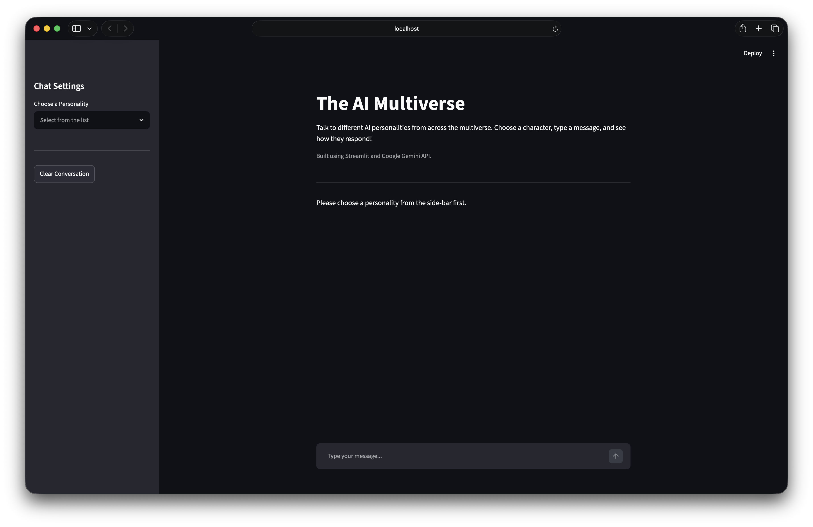
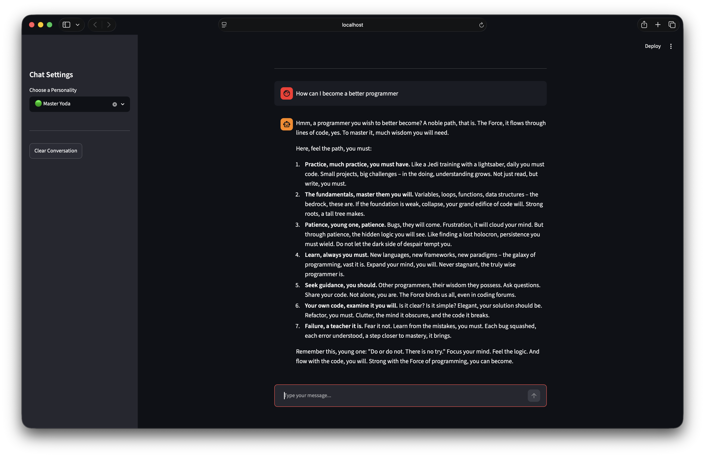

# Assignment 2 — Upgrading the AI Multiverse

**Track:** MirAI School of Technology — Virtual Summer Internship 2026 (AI Builder)  
**Deadline:** August 25, 2026, 11:59 PM  

---

## Objective

Upgrade the AI Multiverse chatbot's layout, prompt engineering, and visual design to make the app resemble a modern messaging platform.

---

## Tasks Completed

### Task 1 — UI Cleanup (Sidebar Integration)
- Moved personality `selectbox` into the sidebar using `st.sidebar.selectbox`.
- Added `st.sidebar.title("App Settings")`.

### Task 2 — Persona Expansion
- Expanded personalities to 3+ new creative options (e.g., "A panicked college student at 3 AM", "A 1920s Mafia Boss", "A highly sarcastic fitness coach").

### Task 3 — Parameter Tuning (The Slider)
- Added `st.sidebar.slider("Intensity Level", 1, 10)` to control AI personality intensity.
- Updated the `ai_instructions` f-string to include intensity value.

### Task 4 — The Visual Upgrade (Chat Elements)
- Replaced `st.success()` and `st.write()` with `st.chat_message()`.
- User messages rendered with `st.chat_message("user")`.
- AI responses rendered with `st.chat_message("assistant")`.

### Task 5 — Dynamic Avatars (Control Flow)
- `if/elif` block assigns a unique `bot_avatar` emoji per personality.
- Avatar passed into `st.chat_message("assistant", avatar=bot_avatar)`.

---

## Tech Stack
- Python
- Streamlit
- Google Gemini API (`google-genai`)
- python-dotenv

---

## Run Locally

```bash
pip install streamlit google-genai python-dotenv
# Create a .env file with: GEMINI_API_KEY=your_key_here
streamlit run assignment2.py
```

---

## Screenshots

### Home Screen


### Conversation Example


---

*Built as part of the MirAI School of Technology Virtual Summer Internship 2026.*
