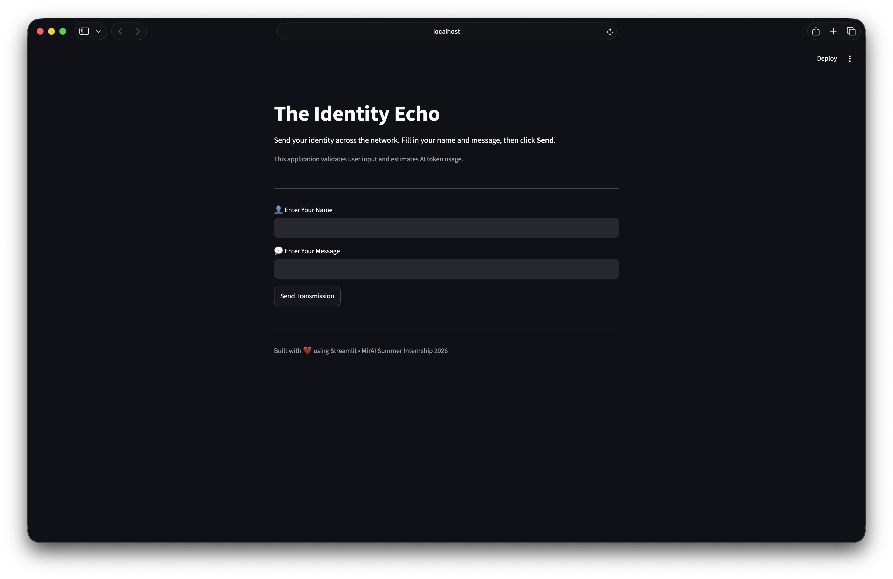
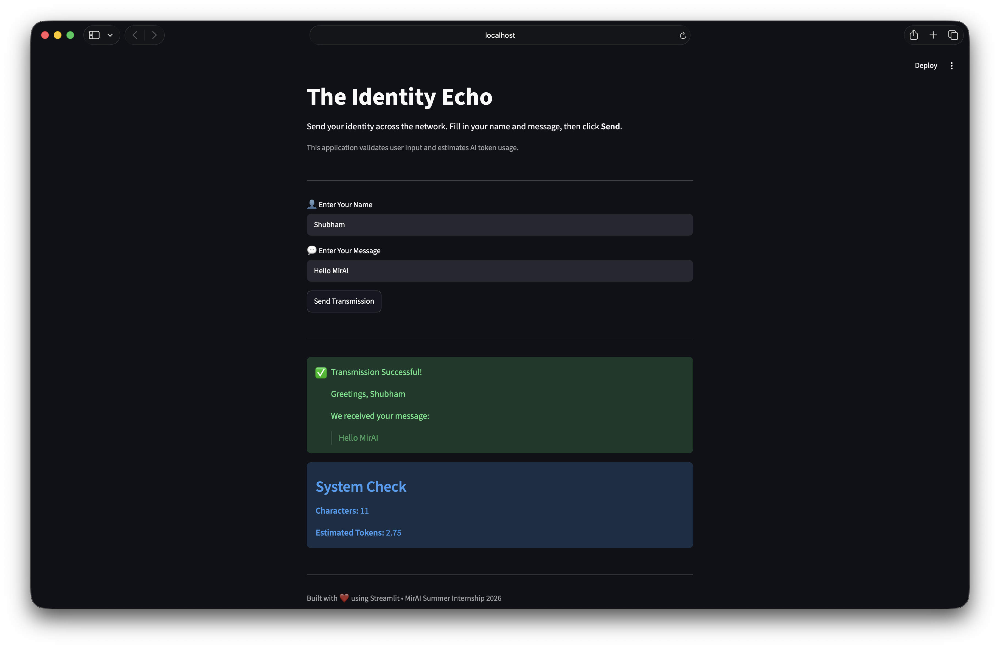

# Assignment 7 — The "Life-OS" Wellbeing Dashboard

**Track:** MirAI School of Technology — Virtual Summer Internship 2026 (AI Builder)  
**Deadline:** August 25, 2026, 11:59 PM  

---

## Objective

Build a "Life-OS" Streamlit dashboard that visualizes daily screen time data from a synthetic CSV dataset and uses the Gemini API as a personalized productivity and lifestyle coach — giving actionable, real-world replacement suggestions rather than generic advice.

---

## Architecture

```
screentime.csv
      │
      ▼
pd.read_csv()  ──►  Pandas DataFrame
      │
      ├──► KPI Row (st.metric + st.columns)
      ├──► Bar/Line Charts (st.bar_chart / st.line_chart)
      └──► Data Bridge (aggregated string)
                │
                ▼
          Gemini API ──► Lifestyle Coach Analysis ──► st.markdown / st.info / st.warning
```

---

## Tasks Completed

### Phase 1 — The Data Pipeline
- Created `screentime.csv` with columns: `Date`, `App_Name`, `Category`, `Minutes_Used`.
- 14+ days of realistic screen time data populated via `csv_generator.py`.
- Data loaded with `pd.read_csv("screentime.csv")`.

### Phase 2 — The Command Center UI
- **Sidebar Controls:** `st.selectbox` to filter by day, `st.slider` to set daily screen time goal.
- **KPI Row:** `st.columns` + `st.metric` displaying:
  - Total screen time today
  - Most used app of the day
  - Delta vs daily goal with `delta_color="inverse"`
- **Visualizations:** Line chart showing 14-day screen time trends.

### Phase 3 — The AI Integration
- **Data Bridge:** Aggregates daily usage per category, converts to a clean string via `.to_string()`.
- **System Prompt:** Instructs Gemini to act as a holistic life coach analyzing specific category usage and suggesting physical, real-world replacements (e.g., replacing 3 hours of TikTok with fitness or meal prepping).
- **Output:** Rendered with `st.markdown`, `st.info`, or `st.warning` based on severity.

### Phase 4 — Innovation Deliverable ✅
- **The Voice Journal:** Integrated `streamlit-mic-recorder` for 10-second daily reflections.
- Audio transcript passed alongside CSV data for a highly personalized Gemini coaching response.

---

## Tech Stack
- Python
- Streamlit
- Pandas
- Google Gemini API (`google-genai`)
- streamlit-mic-recorder
- python-dotenv

---

## Run Locally

```bash
pip install streamlit pandas google-genai streamlit-mic-recorder python-dotenv
# Create a .env file with: GEMINI_API_KEY=your_key_here
streamlit run assignment7.py
```

---

## Screenshots

### Dashboard Home


### AI Analysis Output


---

*Built as part of the MirAI School of Technology Virtual Summer Internship 2026.*
