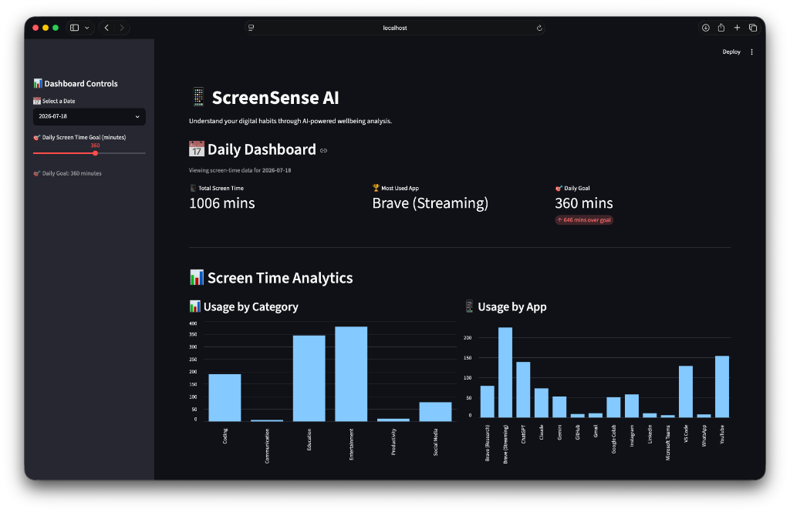
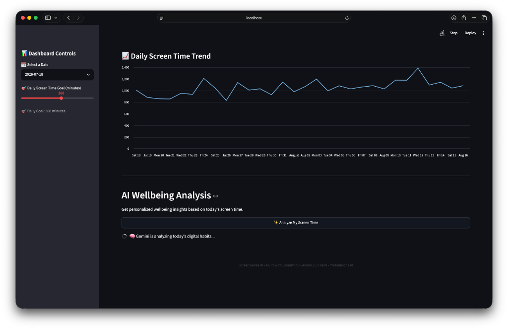
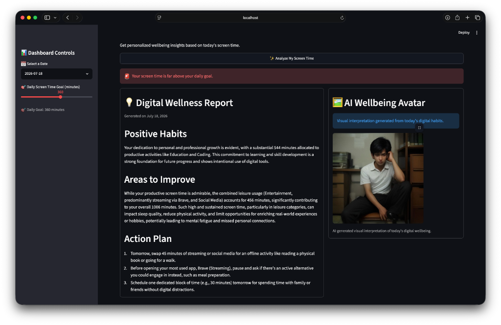

# 📱 ScreenSense AI — Digital Wellbeing & AI Lifestyle Coach

> An intelligent analytics dashboard that transforms raw device screen-time data into actionable wellness insights and generative AI avatar reflections.

---

## Overview

**ScreenSense AI** bridges the gap between passive screen-time tracking and active behavioral change. Built with **Streamlit**, **Pandas**, **Google Gemini 2.5 Flash**, and **Pollinations AI**, it ingests daily usage datasets, visualizes behavioral trends across categories and apps, and generates holistic digital wellness assessments paired with real-time AI-generated mood avatars.

---

## Screenshots & Visual Walkthrough

### 📊 1. Daily Dashboard & Screen Time Analytics
*Interactive KPI metrics and multi-dimensional category/app breakdown.*



---

### 📈 2. Historical Screen Time Trends & AI Analysis Trigger
*Longitudinal screen-time trendline paired with on-demand AI wellbeing coaching.*



---

### 💡 3. AI Digital Wellness Report & Emotional Avatar Reflection
*Structured wellbeing breakdown (Positive Habits, Areas to Improve, Action Plan) alongside an AI-generated mood avatar illustrating the user's daily habits.*



---

## Key Features

- 📅 **Interactive Date & Goal Selection**: Select any historical date and adjust your target daily screen-time threshold dynamically.
- 🎯 **Smart KPI Metrics**: Instant visibility into Total Screen Time, Most Used App, and Goal Variance with adaptive delta badges (`over goal` / `under goal`).
- 📊 **Categorical & App-Level Analytics**:
  - **Usage by Category** (Coding, Education, Productivity vs. Entertainment, Social Media)
  - **Usage by App** sorted in descending order for rapid hotspot identification
- 📈 **Longitudinal Trendline**: Line chart tracking daily aggregate usage across weeks to uncover burnout and recovery patterns.
- 🧠 **AI Lifestyle Coach (Gemini 2.5 Flash)**:
  - Differentiates productive screen time from passive leisure consumption.
  - Generates structured, empathetic feedback:
    - **Positive Habits**: Acknowledges productive focus and discipline.
    - **Areas to Improve**: Explains psychological and physical risks of excessive leisure screen time.
    - **Action Plan**: Delivers 3 concrete, realistic offline replacement habits (e.g., walking, meal prep, reading).
- 🖼️ **Generative AI Wellbeing Avatar (Pollinations AI)**:
  - Translates digital metrics into a prompt describing the user's emotional and physical state.
  - Automatically renders a photorealistic, cinematic visual representation of the user's daily digital balance.

---

## Tech Stack

| Component | Technology | Purpose |
|---|---|---|
| **Frontend & UI** | [Streamlit](https://streamlit.io/) | Responsive web dashboard & container layout |
| **Data Processing** | [Pandas](https://pandas.pydata.org/) | Time-series aggregation, grouping, & KPI computation |
| **LLM Reasoning** | [Google Gemini 2.5 Flash](https://ai.google.dev/) | Structured wellbeing analysis & avatar prompt engineering |
| **Generative Art** | [Pollinations AI](https://pollinations.ai/) | Real-time cinematic image generation from prompt data |
| **Config & Secrets** | `python-dotenv` | Secure API key management |

---

## Architecture & Data Flow

```
┌──────────────────┐
│  screentime.csv  │ ──► Pandas Data Pipeline (Filtering, KPIs, Grouping)
└──────────────────┘                 │
                                     ├──► Streamlit Dashboard (Metrics & Charts)
                                     │
                                     └──► Data Bridge (Category Aggregates)
                                                │
                                                ▼
                                    ┌───────────────────────┐
                                    │ Google Gemini 2.5     │
                                    └───────────────────────┘
                                       │                 │
                                       ▼                 ▼
                         Structured Wellness Report   Image Prompt
                                       │                 │
                                       ▼                 ▼
                              Streamlit UI Cards   Pollinations AI
                                                         │
                                                         ▼
                                                AI Wellbeing Avatar
```

---

## Getting Started

### 1. Clone & Install Dependencies

```bash
git clone https://github.com/ShubhamSnSharma/mirai-ai-summer-internship-2026.git
cd mirai-ai-summer-internship-2026/"Assignment 7"
pip install streamlit pandas google-genai python-dotenv requests
```

### 2. Configure Environment

Create a `.env` file in the project folder:
```env
GEMINI_API_KEY=your_google_gemini_api_key_here
```

### 3. Generate Sample Data (Optional)

If `screentime.csv` is not present, generate realistic multi-week synthetic data:
```bash
python csv_generator.py
```

### 4. Launch the Dashboard

```bash
streamlit run assignment7.py
```

Open your browser at `http://localhost:8501`.

---

*Built as part of the MirAI School of Technology — Virtual Summer Internship 2026.*
