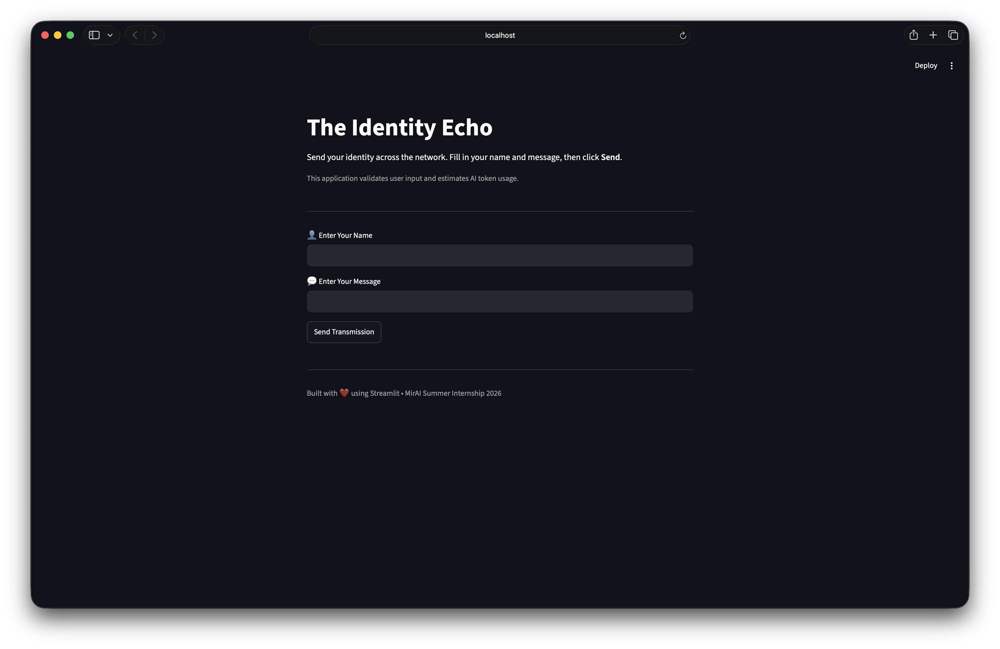
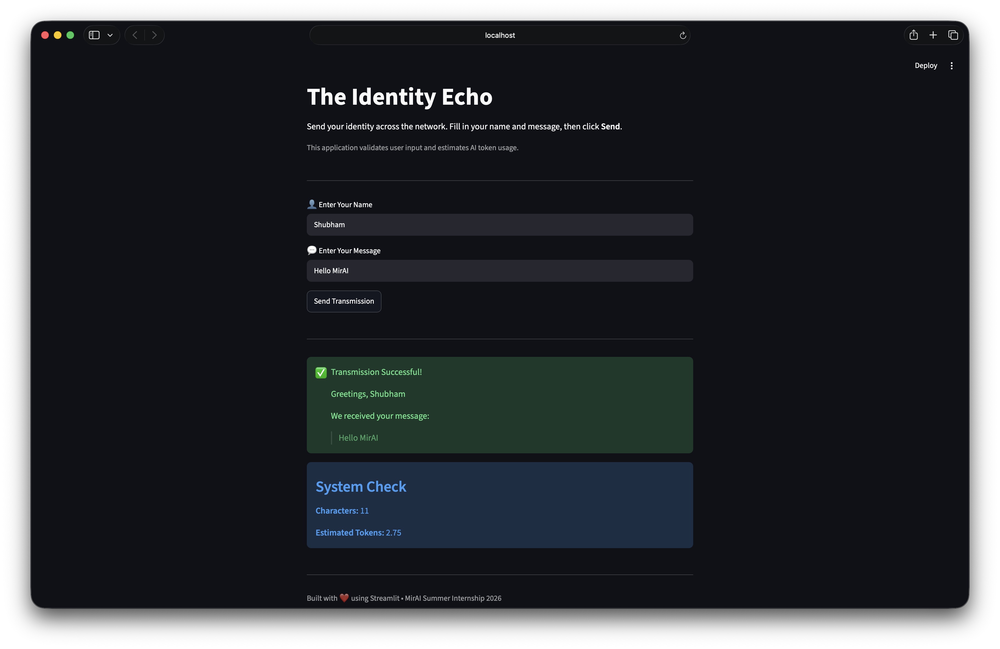

# Assignment 1 - The Identity Echo Interface

## Objective

Build an interactive Streamlit application that:

- Collects a user's name
- Collects a message
- Validates user input
- Displays a personalized response
- Estimates AI token usage

---

## Features

- ✅ User Name Input
- ✅ Message Input
- ✅ Input Validation
- ✅ Success & Error Messages
- ✅ Token Cost Estimator
- ✅ Clean Streamlit Interface

---

## Technologies Used

- Python
- Streamlit

---

## Project Structure

```text
assignment1/
│
├── app.py
├── requirements.txt
├── README.md
└── screenshots/
```

---

## How to Run

```bash
pip install -r requirements.txt
streamlit run app.py
```

## 📸 Screenshots

### 🏠 Home Screen

Displays the initial interface where users can enter their name and message before submitting.



---

### ✅ Successful Transmission

Shows the personalized success message along with the estimated AI token consumption after a valid submission.



---


## Concepts Covered

- Streamlit UI
- User Input
- Conditional Statements
- f-Strings
- Token Estimation
- Basic AI Concepts
