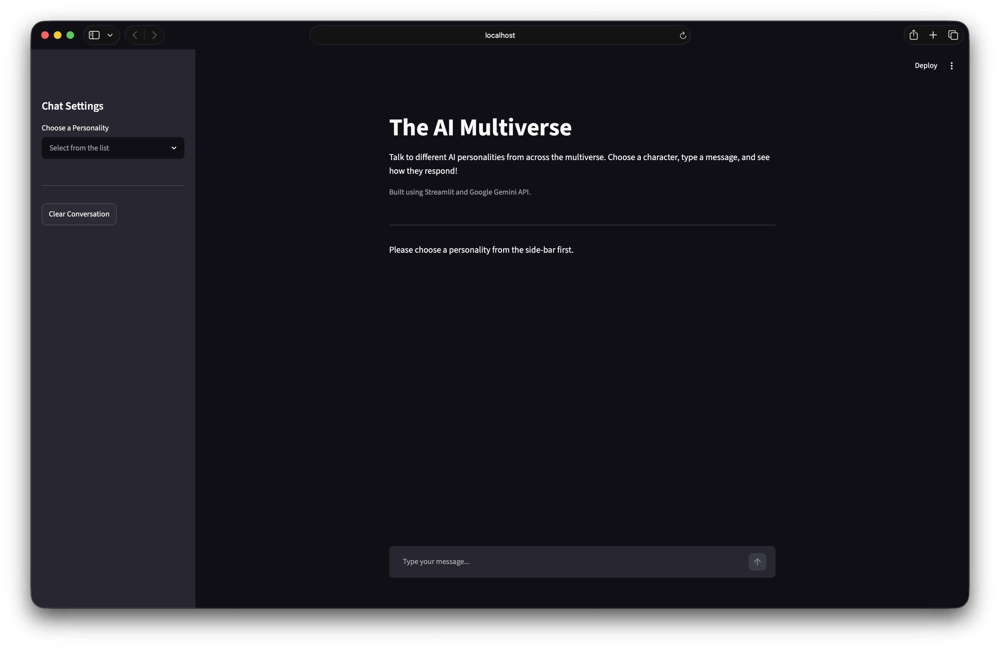
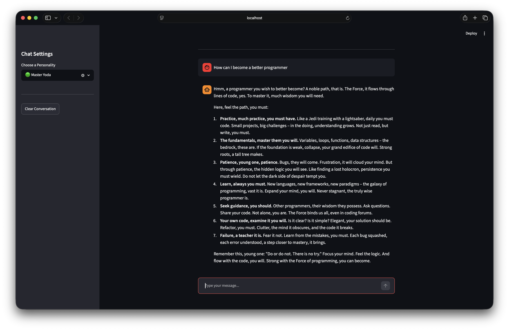

# AI Multiverse

A simple AI chatbot built with **Streamlit** and the **Google Gemini API** as part of my MirAI School of Technology Summer Internship.

This project upgrades the chatbot demonstrated during the session by adding a cleaner interface, multiple AI personalities, and conversation history.

---

## Features

- Chat with different AI personalities
- Conversation history during the current session
- Clean Streamlit chat interface
- Secure API key management using `.env`
- Error handling for API requests

---

## Tech Stack

- Python
- Streamlit
- Google Gemini API (`google-genai`)
- python-dotenv

---

## Getting Started

1. Clone the repository

```bash
git clone <repository-url>
```

2. Install the required packages

```bash
pip install -r requirements.txt
```

3. Create a `.env` file

```env
GEMINI_API_KEY=YOUR_API_KEY
```

4. Run the application

```bash
streamlit run app.py
```

---

## Screenshots

### Home Screen



---

### Conversation Example



---

## What I Learned

Through this project I practiced:

- Building interactive UIs with Streamlit
- Integrating the Google Gemini API
- Writing prompts to guide AI personalities
- Managing API keys using environment variables
- Improving a basic chatbot into a more user-friendly application

---

*Built as part of the MirAI School of Technology Virtual Summer Internship 2026.*
