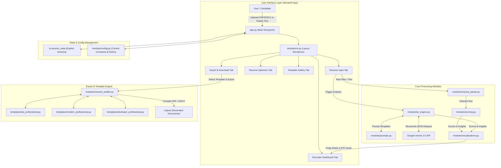

# System Architecture — AI Resume Critic & Career Optimizer

## Overview
The **AI Resume Critic** is a production-grade Streamlit application designed for B.Tech Capstone evaluation (Problem Statement #17). It processes candidate resumes alongside target job descriptions, leverages Google Gemini 2.5 API for recruiter-grade evaluation and roasts, visualizes quantitative ATS match metrics using Plotly, and exports optimized resume templates in PDF/DOCX formats.

---

## High-Level Architecture Diagram (Mermaid)

---

## Module Responsibilities

| Module | Responsibility |
| :--- | :--- |
| `app.py` | Configures Streamlit page, initializes session state, renders main UI container. |
| `modules/config.py` | Central configuration, theme colors, Gemini model parameters, and default state definitions. |
| `modules/ui.py` | Header, sidebar, footer, and tab navigation layout renderers. |
| `modules/resume_parser.py` | Extracts text and splits sections from PDF, DOCX, and TXT files. |
| `modules/prompts.py` | Tailored system prompts, dynamic recruiter personas, and JSON schemas for Gemini. |
| `modules/ai_engine.py` | Gemini API client wrapper, handling requests, retries, and structured JSON parsing. |
| `modules/scoring.py` | TF-IDF keyword frequency matching, ATS score weighting, and delta calculations. |
| `modules/visualizations.py` | Interactive Plotly radar charts, score gauges, and dynamic KPI cards. |
| `modules/resume_builder.py` | Compiles structured resume JSON into styled PDF (ReportLab) and DOCX files. |
| `templates/` | Modular layout templates (`ats_professional`, `modern_professional`, `developer_professional`). |
| `output/` | Temporary file storage directory for generated document exports. |
